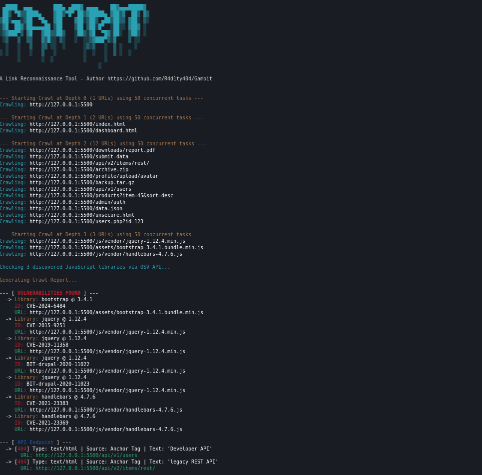

# Gambit

A high-performance, asynchronous, JS-aware Python crawler for discovering and classifying web endpoints and vulnerabilities.

This tool recursively crawls a target website, renders JavaScript using Playwright, and identifies interesting links, subdomains, and outdated JavaScript libraries from a wide range of sources.



## Features

-   **High-Concurrency Engine**: Uses `asyncio` and `Playwright` for massively parallel and fast scanning.
-   **Full JavaScript Rendering**: Accurately analyzes modern, single-page applications (SPAs).
-   **Vulnerability Scanning**: Identifies outdated JavaScript libraries and reports their known vulnerabilities (CVEs) by querying the live OSV.dev API.
-   **Advanced Endpoint Discovery**: Finds paths in `<a>` tags, `<script>` sources, `` sources, `<link>` tags, HTML comments, and `<form>` actions.
-   **Subdomain Discovery**: Automatically identifies and reports links to subdomains of the main target.
-   **Authenticated Scans**: Supports session cookies to scan behind login pages.
-   **Save & Resume**: Can save progress and resume interrupted scans for large targets.
-   **Multiple Report Formats**:
    -   Live, colorized console output.
    -   Interactive, searchable, and sortable HTML report.
    -   Filtered, URL-only text file for use in other tools.

## Installation

1.  Clone the repository to your local machine:
    ```bash
    git clone https://github.com/R4d1ty404/Gambit.git
    ```
2.  Navigate into the project directory:
    ```bash
    cd Gambit
    ```
3.  Install all the required Python packages:
    ```bash
    pip install -r requirements.txt
    ```
4.  Install the browser binaries for Playwright (this is a one-time setup):
    ```bash
    playwright install
    ```

## Usage Guide

### Basic Command Structure
```bash
python3 gambit.py <URL> [OPTIONS]
```

### Examples

-   **Quick scan of a single page:**
    ```bash
    python3 gambit.py https://example.com -d 0
    ```

-   **In-depth scan, saving an HTML report and session progress:**
    ```bash
    python3 gambit.py https://example.com -d 3 -c 50 --html report.html --session large_scan.pkl
    ```

-   **Authenticated scan using a session cookie:**
    ```bash
    python3 gambit.py https://example.com --cookie "sessionid=abc123xyz"
    ```

-   **Find all login pages and save them to a text file:**
    ```bash
    python3 gambit.py https://example.com -d 2 -o login_pages.txt -f login
    ```

### Argument Reference

| Argument | Description |
| :--- | :--- |
| `url` | **(Required)** The starting URL to scan. |
| `-h`, `--help` | Show the help message and exit. |
| `-d`, `--depth` | Maximum crawl depth. Default: 1. |
| `-c`, `--concurrency` | Number of concurrent tasks to run. Default: 20. |
| `--cookie` | Add session cookies for authentication. Format: 'name=value'. |
| `--session` | File to save and resume crawl state from (e.g., scan.pkl). |
| `-o`, `--output` | Save filtered results to a specified text file. |
| `-f`, `--filter` | Filter for the text file output. Use `all` or one/more categories. |
| `--html` | Generate and save an interactive HTML report. |